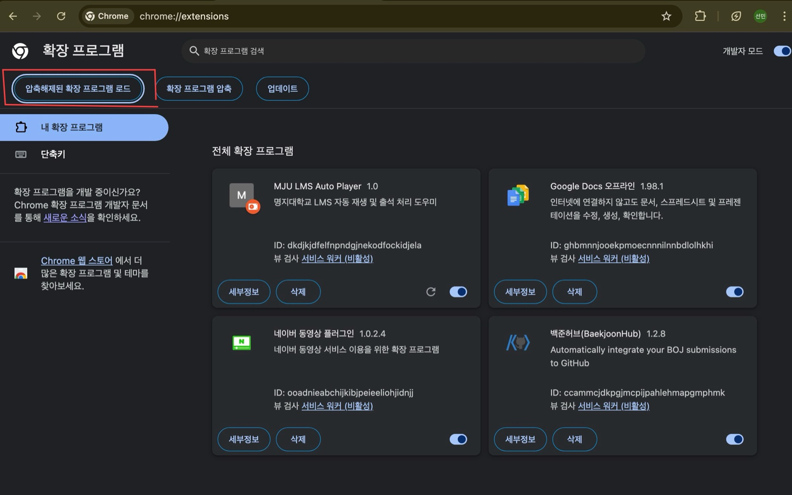
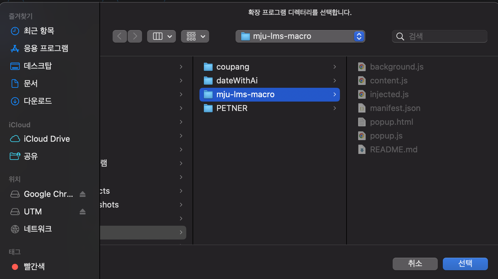
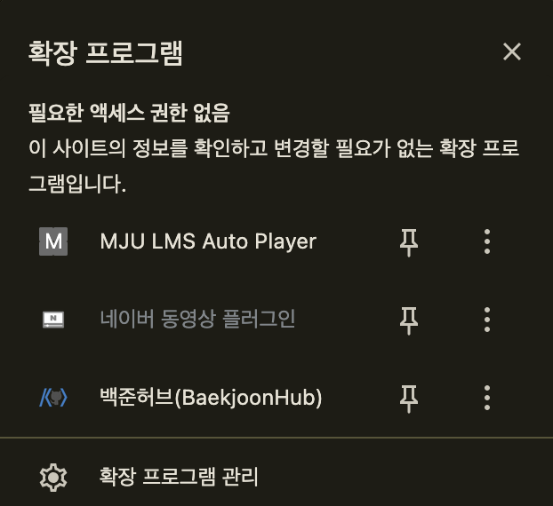
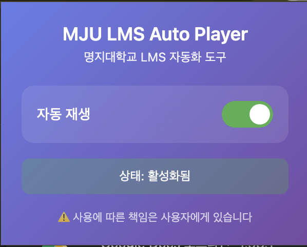

# MJU LMS Auto Player

명지대학교 LMS(Learning Management System)의 동영상 강의 시청 편의성을 높이기 위한 자동화 크롬 확장 프로그램입니다.

## ⚠️ 주의사항(필독)

이 프로그램은 **개인적인 학습 및 편의를 위해 개발되었습니다**.

학교 측의 모니터링 시스템(로그 분석)에 의해 비정상적인 수강 패턴이 감지될 경우, **출석 취소나 징계 등의 불이익**을 받을 수 있습니다.

**개발자 본인은 이를 인지하고 있으며, 실제 사용 시 발생할 수 있는 모든 책임은 사용자 본인에게 있습니다.**

현재 LMS 창을 벗어나면 영상이 간혹 재생이 되다가 멈추는 문제가 확인되었습니다. 화면을 띄워놓지 않을 

경우 작동이 잘 안되니 이 점을 참고하기 바랍니다.

---

## 기능 (Features)

- ✅ 비디오 자동 재생 (음소거)
- ✅ 영상 종료 시 자동으로 '다음' 버튼 클릭 → 연속 영상 자동 재생
- ✅ 마지막 영상 종료 시 "Last Content" 팝업 자동 차단
- ✅ 마지막 영상 후 '출석(종료)' 버튼 자동 클릭
- ✅ 학습 체크 팝업 자동 처리 (3초 간격)
- ✅ 팝업 UI를 통한 ON/OFF 제어

---

## 기술 스택 (Tech Stack)

| 분류 | 기술 | 설명 |
|:---|:---|:---|
| **Platform** | **Chrome Extension (Manifest V3)** | 보안과 성능이 강화된 최신 크롬 확장 프로그램 표준 |
| **Core** | **Vanilla JavaScript (ES6+)** | 외부 라이브러리 없이 가볍고 빠른 DOM 제어 구현 |
| **Communication** | **Chrome Runtime API** | Context 간 데이터 교환 (`sendMessage`, `onMessage`) |
| **UI** | **HTML5 / CSS3** | 팝업 UI 구성 |

---

## 아키텍처 (Architecture)

LMS 페이지는 **메인 페이지(출석/다음 버튼)**와 **비디오 플레이어(iframe)**가 분리되어 있습니다. 도메인이 다를 경우 발생할 수 있는 **CORS** 문제를 해결하기 위해 **Message Passing** 패턴을 사용합니다.

### 데이터 흐름도 (Data Flow)

1. **Video Frame (Content Script A):** `<video>` 태그 감지 및 재생 → 종료(`ended`) 이벤트 감지 → **"VIDEO_ENDED" 메시지 발송**
2. **Background Script (Service Worker):** 메시지를 수신하고 현재 활성화된 탭의 **Main Frame으로 메시지 중계 (Relay)**
3. **Main Frame (Content Script B):** "VIDEO_ENDED" 메시지 수신 → **'다음' 또는 '출석(종료)' 버튼 클릭**

---

## 설치 방법 (Installation)

### 1. 다운로드

이 저장소를 클론하거나 ZIP 파일로 다운로드합니다.

```bash
git clone https://github.com/sunm2n/MJU_LMS_mecro.git
cd mju-lms-macro
```

### 2. 크롬 확장 프로그램 로드

1. 크롬 브라우저 주소창에 `chrome://extensions` 입력



2. 우측 상단 **'개발자 모드(Developer mode)'** 스위치 ON

3. 좌측 상단 **'압축해제된 확장 프로그램을 로드합니다'** 클릭



4. `mju-lms-macro` 폴더 선택



5. 확장 프로그램에 잘 뜨는지 확인한다.



6. 재생 버튼 활성화를 확인한다.

### 3. 사용

1. 명지대 LMS 강의 화면에 접속
2. F5(새로고침)을 누르면 자동으로 동작 시작
3. F12(개발자 도구)를 열어 콘솔 로그를 확인할 수 있습니다

### 4. ON/OFF 제어

- 확장 프로그램 아이콘을 클릭하면 팝업이 열립니다
- 토글 스위치로 자동 재생 기능을 켜고 끌 수 있습니다

---

## 디렉토리 구조 (Directory Structure)

```text
mju-lms-macro/
├── manifest.json        # 확장 프로그램 설정 파일
├── injected.js          # 페이지 컨텍스트 팝업 차단 (world: MAIN)
├── content.js           # DOM 조작 및 이벤트 감지 (핵심 로직)
├── background.js        # 메시지 중계자 (Service Worker)
├── popup.html           # 팝업 UI
├── popup.js             # 팝업 제어 스크립트
└── screen/              # 스크린샷 폴더
    ├── screen1.jpg      # 다운로드 화면
    ├── screen2.png      # 확장 프로그램 페이지
    ├── screen3.png      # 확장 프로그램 로드
    └── screen4.png      # 설치 완료
```

---

## 향후 개선 사항 (To-Do)

- [ ] 네트워크 오류 등으로 영상이 멈췄을 때 재시도 로직 추가
- [ ] 옵션 페이지 추가 (설정 UI)
- [ ] 현재 LMS 페이지를 띄워놓지 않으면 작동에 문제가 생김 창을 보고 있지 않더라도 돌아갈 수 있도록 개선 

---

## 면책 조항 (Disclaimer)

이 소프트웨어는 "있는 그대로" 제공되며, 명시적이든 묵시적이든 어떠한 종류의 보증도 하지 않습니다.

사용으로 인해 발생하는 모든 결과에 대한 책임은 사용자에게 있습니다.
